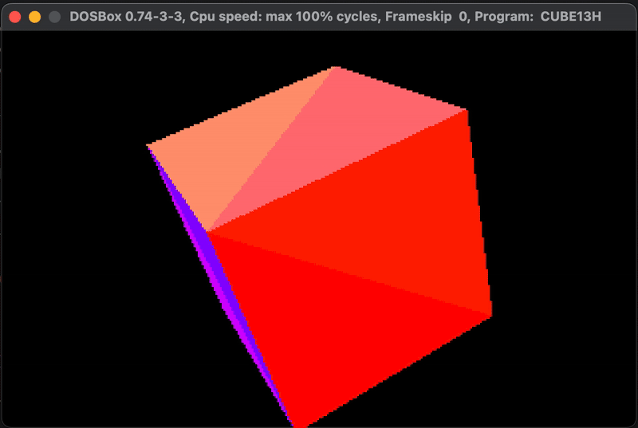

# cube13h

cube13h is a simple 3D graphics demonstration program written in Turbo C++ and x86 assembly for PC DOS. It demonstrates basic graphics programming techniques to render and animate a 3D cube on the screen, in mode 13h (320x200) colors.
For the EXE file, download it from [itch.io](https://ms0g.itch.io/cube13h).

## Features
- Triangle rasterization.
- 3D vertex transformations.
- Perspective projection to simulate depth.
- Backface culling.
- Bresenham's line algorithm to draw lines between vertices to create the cube’s edges.
- Double buffering to reduce flickering and tearing.

## Prerequisites
- Turbo C++ (>= 3.0)
- Turbo Assembler (>= 4.1)
- DOSBox or a real DOS computer

## Usage
1. Download or clone the cube13h repository to your local machine.
2. Open a DOS terminal or DOS emulator such as DOSBox.
3. Navigate to the directory containing the cube13h executable.
4. Run the cube13h executable by typing `cube13h` and pressing Enter.

## Controls
- Press the ESC key to exit the application.

## Building from Source
If you want to build cube13h from source, you'll need Turbo C++ and the related [build tools](https://github.com/ms0g/breakout/tree/main/TOOLS/tcpp). 

## License

This project is licensed under the BSD 3-Clause License. See the LICENSE file for details.
